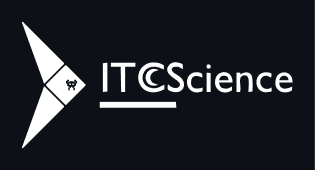

# Home Page Web Static | ITCScience

Home web for the **ITCScience organization**, dedicated to the dissemination of topics related to information technology and computer science.



## Tech Stack

- Pug (Preprocessor HTML)
- Sass (Preprocessor CSS)

## Demo

This project is hosted and published on the web using the *Github Pages* hosting service, visit it here 👉 [Website ITCScience](https://fr4nkd3v.github.io/ITCScience-Home-Page/).

## Screenshots


## Installation

**Clone the project** and **install dependencies** with npm:

```bash
  git clone https://github.com/fr4nkd3v/ITCScience-Home-Page.git
  cd ITCScience-Home-Page
  npm install
```

## Run Locally

After installation start the local server:

```bash
  npm run start
```

For development start with:

```bash
  npm run dev:watch
```

This command starts the project with the watch mode for the local server, the pug compiler and the sass compiler.

## Lessons Learned

In this project I learned several ways to control CSS positioning, how positioning affects descendant elements and their stacking by layers, how to use gradients to build a rich design, how to make interesting animations and how to provide an adaptive design using CSS Grid and media queries.

In addition, I learned how to use new libraries to run tasks in parallel within the shell, and to run them using npm scripts.

## Feedback

If you have any comments or feedback, you can write to me at <frank.code31@gmail.com>.

## Contributing

Contributions are always welcome!

You can do this by creating a new branch from the `main` branch, push your new branch and open a pull request from your branch to the `main` branch.

## Support

For support, send email at <frank.code31@gmail.com>.
